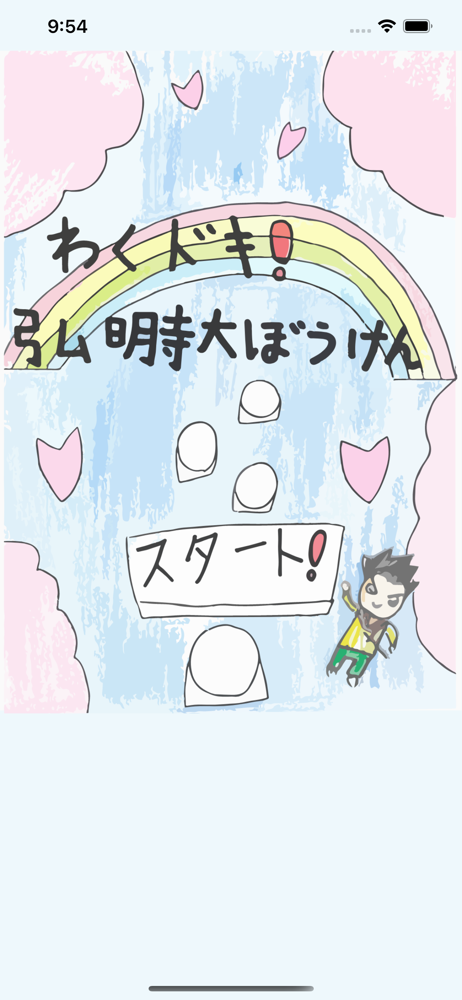
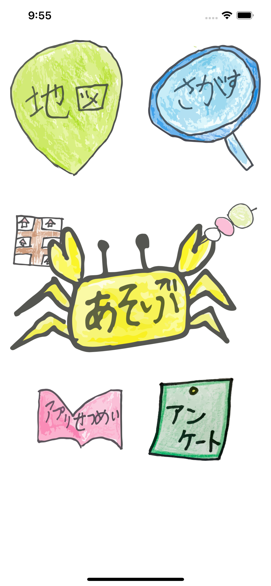
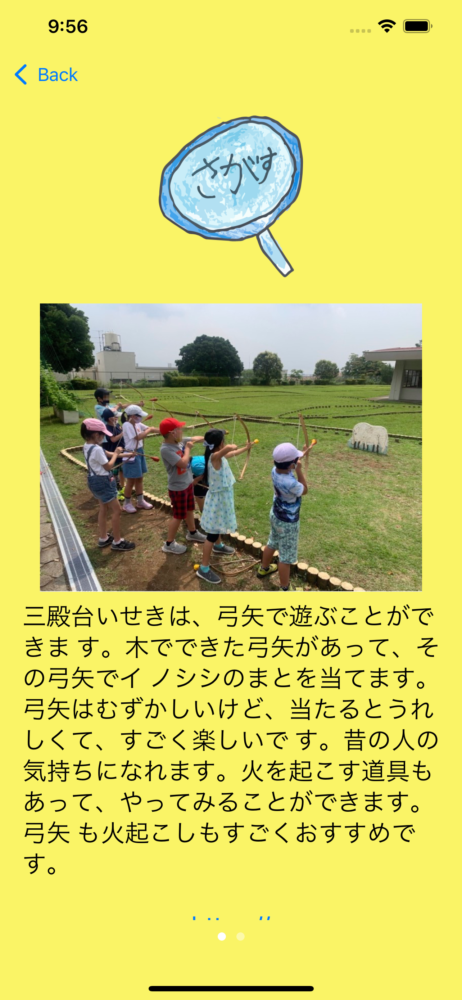
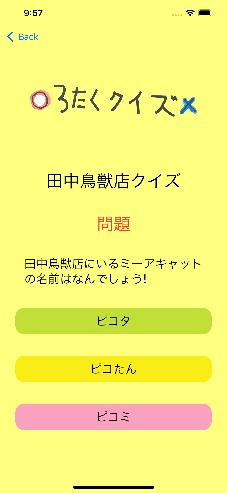
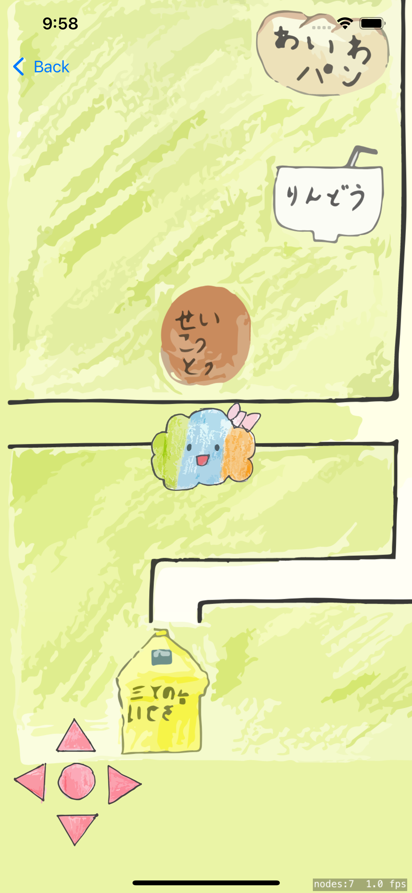
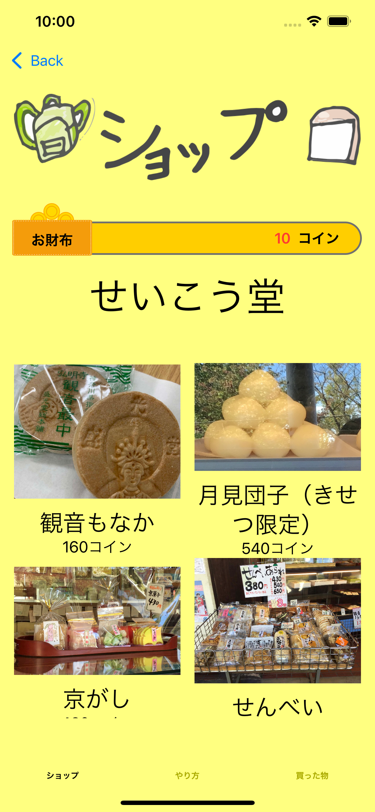

# わくドキ！弘明寺 大ぼうけん

## アプリの情報

|  | 「この状況の中で、なかなかお出かけできなくてつまらない。ひまな時間を、地元・弘明寺で楽しく過ごせたらいいな。弘明寺の楽しい場所やお店の情報が知れて、楽しく遊べるアプリを創りたい！」そんな大岡小学校３年２組の子どもたちの思いから生まれた、「わくドキ！弘明寺大ぼうけん」。 |
| ------------------------------------------------------------ | ------------------------------------------------------------ |
|  | 「地図」「さがす」機能で、弘明寺の遊べる場所やおいしいお店を検索することができます。また「クイズ」「弘明寺大ぼうけん」機能で、弘明寺に実際にあるお店にゲームの中で入ることができ、クイズに正解するとコインゲット！そのコインで「ショップ」にある商品を買うことができます。 弘明寺には楽しい場所やお店がたくさん！ 実際に行ってみると、「こんな楽しいところがあったんだ！」と驚くこと間違いなし。 アプリの中でも、外でも、「弘明寺大ぼうけん」を楽しんでください！ |
|  | １．「地図」「さがす」で楽しい場所を検索しよう！ 弘明寺近辺にある遊べる場所やおいしいお店を検索して、実際に行ってみよう！「地図」では、リストからお店の名前を選択すると、場所がわかるようになっています。「さがす」では「食べる」「運動する」「ゆっくりする」の目的別に探すことができるよ。「おすすめ」には、３年２組イチオシの楽しい場所を掲載しています！ |
|  | ２．「クイズ」に挑戦しよう！ 意外と難しくて面白い、弘明寺３択クイズ。弘明寺のびっくり！な情報を知ることができるよ。正解すると、１問につき５ポイントゲット！全問正解できるかな？ |
|  | ３．「弘明寺大ぼうけん」で街中を探検しよう！ 自分の好きなキャラクターを選んで、十字キーをタップして動かそう。ゲームの中で弘明寺に実際にあるお店に入ると、クイズが出てくるよ。正解すると、２５ポイントゲット！ゲームの中でぼうけん気分を楽しんでね。 |
|  | ４．「ショップ」で欲しい商品をゲットしよう！ コインが貯まったら、好きなお店の商品を選んで買うことができるよ！コインをたくさん貯めて、欲しい商品を買った時の達成感をぜひ味わってね！商品の値段は実際の値段と同じなので、気になったら実際に買いに行って楽しむのもおすすめ。 |

「わくドキ！弘明寺大ぼうけん」は、弘明寺に住む人も知らないような、楽しい場所やお店の情報がつまっています。ゲームの中でも遊べるので、雨の日も楽しめます。
地域に住む人も、遠くに住む人も、子どもも大人も。ぜひ弘明寺で、ゲームの中で、楽しい時間を過ごしてください！

## ダウンロード

([問い合わせ](https://docs.google.com/forms/d/e/1FAIpQLSeiu8Bl6Soqe6fr4K_ziM3I1gQl3iPlRYWXBI9uunRrdxzRng/viewform?usp=sf_link)) ([プライバシーポリシー](PrivacyPolicy.md))

